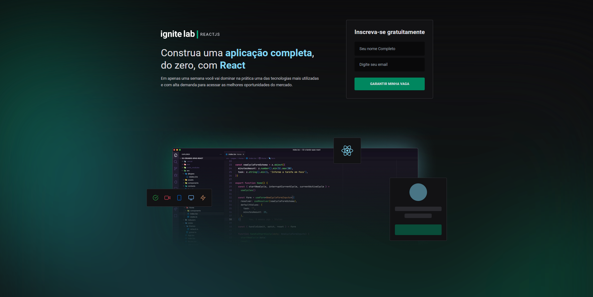
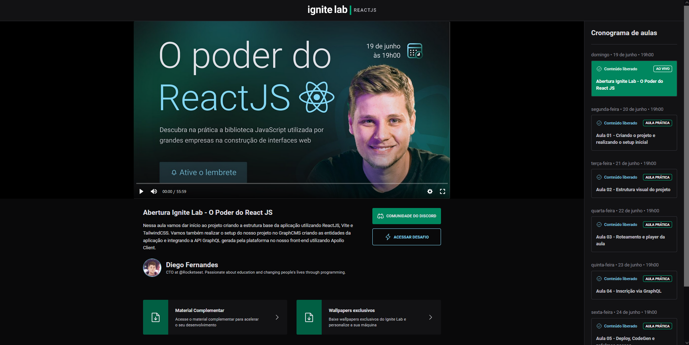

# event-platform
Projeto desenvolvido durante a semana do ignite lab da Rocketseat utilizando Typescript, ReactJS, GraphCMS, GraphQL e Apollo Client.
Plataforma de eventos com hospedagem de videos.


📌 Conteúdo
=================
<!--ts-->
   * [Tecnologias](#Tecnologias)
      * [React](#React)
      * [Typescript](#Typescript)
      * [GraphCMS](#GraphCMS)
      * [GraphQL](#GraphQL)
      * [ApolloClient](#ApolloClient)
<!--te-->

### Fotos
=================
<h1 align="center">
  
</h1>

<h1 align="center">
  
</h1>


### 🎲 Executando a Aplicação

```bash
# Clone este repositório
$ git clone https://github.com/frdbrq/event-platform.git
# Instale as dependências
$ npm install
# Execute 
$ npm run dev
# O servidor inciará na porta:3000 - acesse <http://localhost:3000>
```


### Autor
---

<a href="https://github.com/frdbrq">
 
 <br />
 <sub><b>Fred Buarque</b></sub></a> <a href="https://github.com/frdbrq" title="Rocketseat">🚀</a> <br>

### Projeto desenvolvido com carinho após acompanhar as aulas do Ignite Lab
